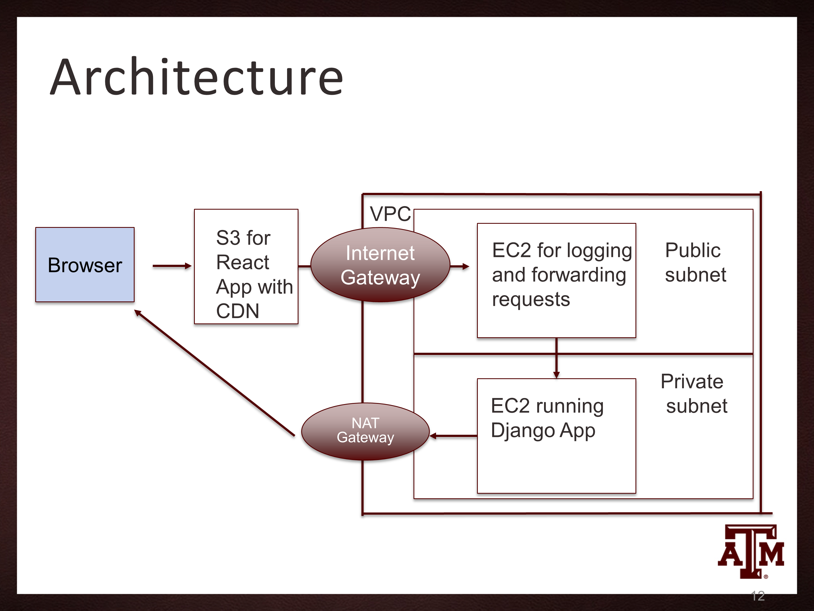

# ShaReCipes - A Recipe Sharing Platform

## Table of Contents
- [Introduction](#introduction)
- [Features](#features)
- [Tech Stack](#tech-stack)
- [Architecture](#architecture)
- [Setup and Deployment](#setup-and-deployment)
- [Usage](#usage)
- [Challenges and Solutions](#challenges-and-solutions)
- [Future Enhancements](#future-enhancements)
- [Contact](#contact)

## Introduction
ShaReCipes is a simple web application that allows users to share and view recipes. The frontend is built using React.js, and the backend is powered by Django. The application is deployed on AWS using S3, EC2, and CloudFront.

## Features
- **Recipe List**: View a list of all recipes.
- **Recipe Detail**: View detailed information about a specific recipe.
- **Add Recipe**: Add a new recipe.
- **Update Recipe**: Update an existing recipe.
- **Delete Recipe**: Delete a recipe.

## Tech Stack
- **Frontend**: React.js
- **Backend**: Django, Django REST Framework
- **Database**: SQLite (for development)
- **Deployment**: AWS S3, AWS EC2, AWS CloudFront, Nginx

## Architecture


1. **AWS S3**: Hosts the static files of the React.js frontend.
2. **AWS EC2**: Hosts the Django backend.
3. **Nginx on Bastion Host**: Acts as a reverse proxy to forward requests to the Django backend.
4. **AWS CloudFront**: Serves as the CDN for the frontend assets.
5. **Custom VPC**: Contains the EC2 instances, with one private subnet for the backend.

## Setup and Deployment

### Prerequisites
- AWS Account
- Domain name for SSL

### Frontend Deployment
1. **Build the React App**:
   ```sh
   npm run build
